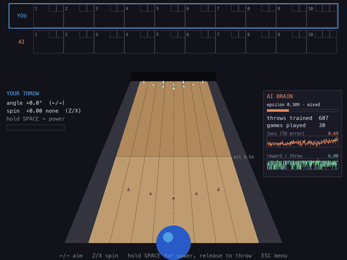

# 🎳 Neural Lanes

[](https://github.com/jaztulsi/neural-lanes/actions/workflows/ci.yml)


**Bowling against an AI that starts terrible and learns to beat you.**

You bowl with keyboard controls; your opponent is a Dueling Double-DQN
(PyTorch) that learns online — a gradient update after *every single throw*,
right there in the game loop. Its brain persists to disk, so it remembers
everything across sessions: lose to it tonight, and it earned that.



## Quickstart

```sh
python -m venv .venv && .venv/bin/pip install -r requirements.txt
.venv/bin/python main.py
```

No assets to download — even the sound effects are synthesized with numpy at
startup.

## Controls

| Key | Action |
|-----|--------|
| ← / → | aim angle |
| Z / X | spin (hook left / right) |
| SPACE (hold + release) | power meter, release to throw |
| TAB (hold) | fast-forward the current roll |
| M | mute / unmute |
| ENTER | start match / confirm |
| A (menu) | spectate: AI vs AI exhibition match |
| R (menu) | reset the AI's learning (asks to confirm) |
| ESC | back to menu / quit (progress auto-saves) |

Tip: straight balls top out around 8-9 pins — strikes need a hooked ball
into the 1-3 (or 1-2) pocket, just like real bowling. The AI has to
discover this too.

## Train the AI headless

Don't want to wait for it to learn one throw at a time? Let it practice
without the GUI:

```sh
.venv/bin/python train.py --games 500
```

It runs the same physics and learning loop at full speed (a few games per
second), saves to the same checkpoint, and prints its average score as it
climbs. Come back and play whoever it has become. The menu screen graphs its
score-per-game learning curve, so you can watch it improve across both
training and live matches.

To benchmark it properly, evaluate the pure greedy policy — no exploration,
no learning, nothing saved:

```sh
.venv/bin/python train.py --eval 50
```

Or press **A** on the menu to watch an **AI vs AI exhibition** — the same
brain bowls both sides, live, and keeps learning while it plays.

## Lane oil

Every match rolls a random **oil pattern** (7.5–13.5 m, shown as a sheen on
the lane). The ball barely hooks while it's on the oil and only grips the
dry backend — short oil means big early hooks, long oil plays nearly
straight. The aim preview accounts for it, so you have to find a new line
every match; oil length is part of the AI's state, so it must adapt too.

## How the AI works

- **Algorithm**: Dueling Double-DQN with a replay buffer, soft target
  updates, and Huber loss — the standard modern DQN recipe, small enough to
  train live on CPU between frames.
- **State** (14 dims): 10 pin bits, frame, ball-in-frame, score gap vs. you,
  oil pattern length.
- **Actions**: 9 angles × 5 powers × 3 spins = 135 discrete throws.
- **Reward**: pins knocked, +5 strike, +3 spare, −2 gutter.
- **Exploration**: epsilon-greedy, decaying with total career throws.
- The on-screen **AI BRAIN** panel shows its epsilon, TD-loss trend, and
  reward trend live, and every throw it makes is labeled with the action it
  chose — you can literally watch it stop guessing.
- Weights, optimizer, replay buffer, and career stats all persist to
  `checkpoints/agent.pt`.

## The physics

`physics.py` is a headless top-down rigid-body sim in real lane units
(metres, regulation geometry): ball/pin and pin-pin impulse collisions with
restitution, friction, spin-driven hook that only grips past the oil, gutters
that swallow the ball, and pins that count as down once displaced off their
spot. Because it never touches pygame, the exact same sim runs the on-screen
game and the fast headless trainer.

## Extras

- Strike-streak banners (STRIKE! / DOUBLE! / TURKEY!), split detection
  (SPLIT!, with a special 7-10 callout), confetti, ball trail, screen flash.
- Synthesized sound effects (ball rumble, pin crash scaled by pins hit,
  strike fanfare, gutter thud) — generated with numpy at startup, no asset
  files (`sounds.py`).
- Career stats on the menu: your win-loss record vs. the AI, both high
  scores, and the AI's learning curve, persisted with the checkpoint.

## Project layout

- `main.py` — game loop, match flow, PyGame setup
- `train.py` — headless self-play training CLI
- `physics.py` — headless ball/pin simulation
- `game_state.py` — 10-frame bowling scoring
- `ai_agent.py` — DQN, replay buffer, training, persistence
- `human_controller.py` — keyboard input
- `ui.py` — all rendering
- `sounds.py` — numpy-synthesized sound effects
- `test_game_state.py` — scoring/split self-checks (`python test_game_state.py` or pytest)
- `checkpoints/` — saved model + replay buffer (gitignored)
